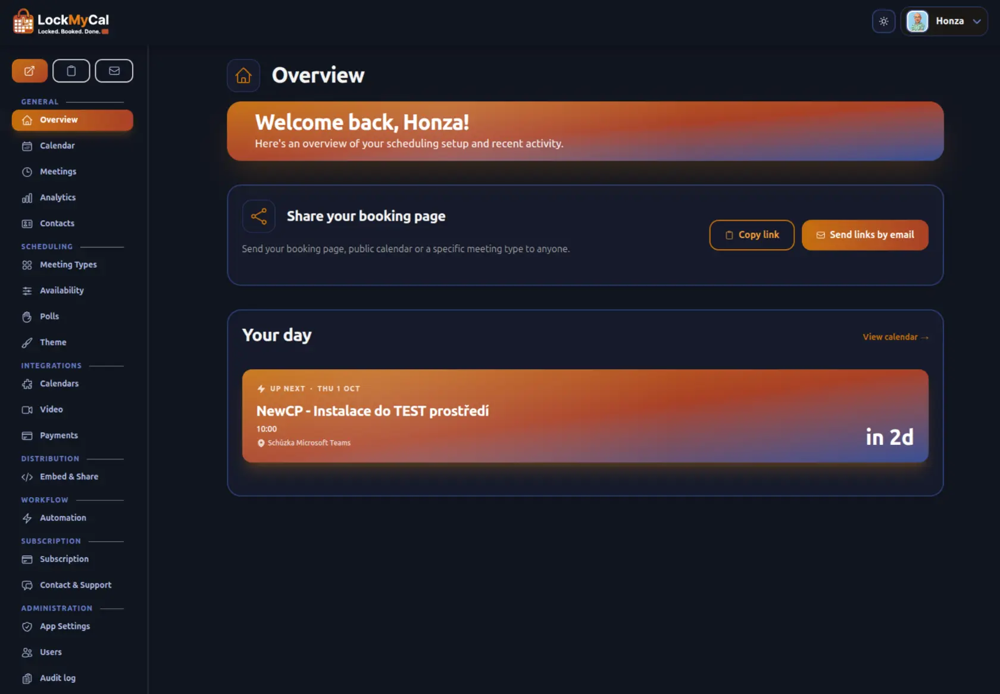
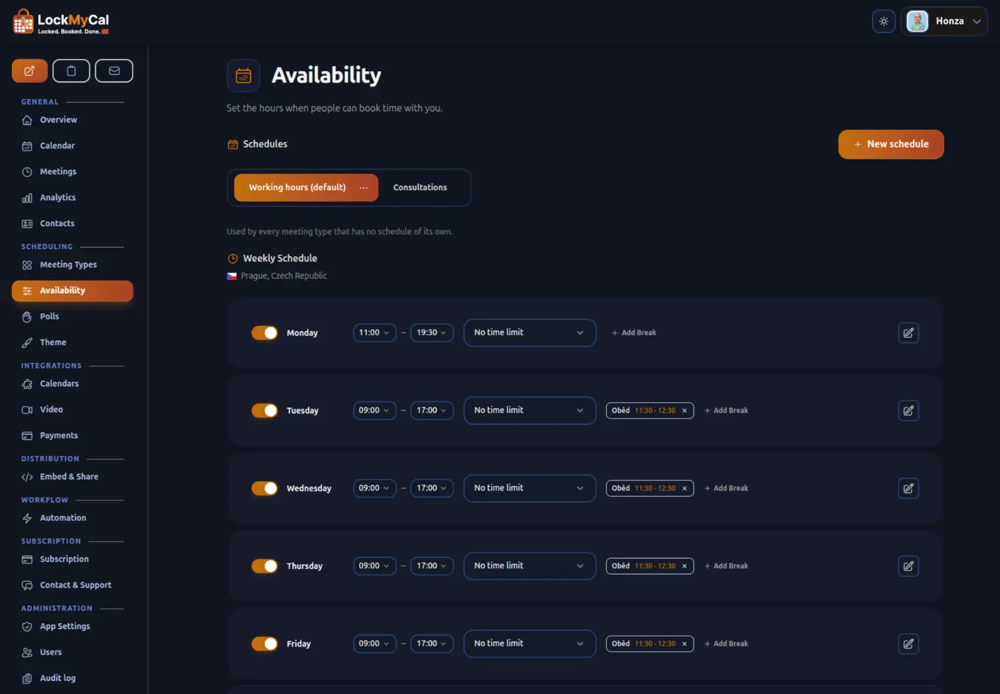
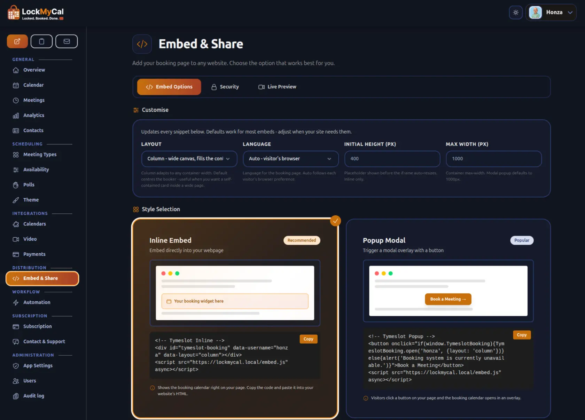
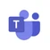

<div align="center">
LOCK


<h3>Scheduling software that stays yours.</h3>

<p>
Booking pages, calendar sync, video rooms and automated emails — running on <b>your</b> server, under your control.<br />
Built on Elixir/OTP, so it keeps running while you sleep.
</p>

<p>
<a href="https://www.gnu.org/licenses/agpl-3.0.html"></a>
<a href="https://elixir-lang.org"></a>
<a href="https://phoenixframework.org"></a>
<a href="https://github.com/phoenixframework/phoenix_live_view"></a>
<a href="https://github.com/lockmycal/lockmycal/commits"></a>
</p>

<p>
<b><a href="#quick-start">Self-host with Docker →</a></b> &nbsp;·&nbsp;
<b><a href="https://lockmycal.app/register">Try the Cloud →</a></b> &nbsp;·&nbsp;
<b><a href="https://learn.lockmycal.com/en">Docs →</a></b> &nbsp;·&nbsp;
<b><a href="https://github.com/lockmycal/lockmycal/issues">Issues →</a></b>
</p>

<br />


<sub>A real booking, start to finish: pick a duration, choose a time, done. &nbsp;·&nbsp; <a href="./priv/static/images/demo/quill.mp4">Watch in HD →</a></sub>

</div>

<br />

> **Open source, and staying that way.** LockMyCal's source is public and self-hostable under the [GNU AGPLv3](LICENSE) — what you run today, you can keep running tomorrow.
Calendly is closed SaaS. Cal.com relicensed away from open source in 2026. Tymeslot's source stays public and self-hostable under the [GNU AGPLv3](LICENSE) — what you run today, you can keep running tomorrow.
>
> **The same code as the cloud.** LockMyCal is the engine behind the managed [LockMyCal cloud](https://lockmycal.app/register), so the code you self-host is the code running in production.

---

## Quick start

LockMyCal runs as two containers: the app, built from this repository, and PostgreSQL.

```bash
git clone https://github.com/lockmycal/lockmycal.git
cd lockmycal
cp .env.example .env   # set SECRET_KEY_BASE, PHX_HOST and POSTGRES_PASSWORD
```

Then build and start it with Docker Compose as described in the [Docker guide](README-Docker.md#build-from-source-docker-compose). The first account you create becomes the admin. SMTP, TLS, a reverse proxy and external Postgres are covered in the same guide.

---

## Everything you need to take bookings

No add-ons, no per-feature upsells. It all ships in the box.

### One place to run your day

Upcoming meetings, quick actions and your whole setup on a single screen. No hunting through menus to change how you take bookings.



### Availability that mirrors reality

Keep as many named schedules as your week needs — weekday office hours, Tuesday evenings, one weekend a month — each with its own working hours, breaks, date overrides, buffers, booking window and minimum notice. Point each meeting type at the schedule it belongs to, and your booking page offers exactly the hours you meant for it.



### Embed it anywhere

Inline on a page, a popup, or a floating button. Copy the snippet, paste it on your site. Tokens are signed and domain-locked, so your widget only runs where you put it.



### Never double-booked

Every connected calendar is checked the moment someone books. One conflict anywhere blocks the slot everywhere — across Google, Outlook, CalDAV and the rest.

---

## And there's more under the hood

- **Email that delivers** — responsive templates, an `.ics` file on every send, configurable reminders, and signed cancel/reschedule links that need no login.
- **Ask the right questions** — add custom questions to any meeting type, so you walk into every call already briefed.
- **Remember who you've met** — every public booking is automatically added to a searchable contacts list (name, email, phone, company), with a private note field and a one-click view of someone's full meeting history. Off by default; enable it in Settings.
- **Quick add, from anywhere** — book a meeting straight from your Meetings page, not just the calendar, and pick the guest from your contacts instead of retyping their name and email. Set a reminder on it too, synced to your calendar and folded into the reminder email.
- **Meet where it suits them**: offer in person, phone, video or somewhere else on any meeting type. Add several and your guest picks one when they book, including which video service.
- **SSO-first auth** — email/password, Google, Microsoft, GitHub, plus generic OAuth/OIDC for Keycloak, Authentik, Okta and Azure AD. Disable registration or password login independently.
- **Privacy by design** — credentials encrypted at rest, no third-party trackers or analytics pixels by default (optionally point it at your own self-hosted Umami instance), rate-limited public endpoints, HMAC-signed webhooks, CSRF and signed tokens throughout.
- **Automate everything** — Slack and Telegram notifications, plus `meeting_created`, `meeting_cancelled` and `meeting_rescheduled` webhooks that plug straight into n8n, Zapier, Make or your own backend.
- **Make it yours** — two booking-page themes (Quill and Rhythm) with custom colours, backgrounds and white-label options.
- **Speaks your language** — the whole app in English, German, Ukrainian, French, Italian and Czech: your dashboard, your booking pages and every email, with dates and times in local convention. Guests get their own language automatically; pick yours in Account settings. Translate your own wording too — meeting names and descriptions, your booking-page welcome text, and custom questions with their answer choices — so a booker sees it in their language, with your original text as the fallback.
- **Get paid to meet** — optional paid bookings through [Stripe Connect](#meeting-payments), off by default and fee-free for self-hosters.

---

## Works with your stack

<b>Calendars</b> — sync availability and write confirmed meetings back, both ways.

<table align="center">
<tr>
<td align="center"><br /><sub>Google Calendar</sub></td>
<td align="center"><br /><sub>Outlook</sub></td>
<td align="center"><br /><sub>Apple iCloud</sub></td>
<td align="center"><br /><sub>CalDAV</sub></td>
</tr>
<tr>
<td align="center"><br /><sub>Nextcloud</sub></td>
<td align="center"><br /><sub>Radicale</sub></td>
<td align="center"><br /><sub>Zimbra</sub></td>
<td align="center"><br /><sub>Baikal</sub></td>
</tr>
<tr>
<td align="center"><br /><sub>mailbox.org</sub></td>
<td></td>
<td></td>
<td></td>
</tr>
</table>

<b>Video &amp; location</b>: offer several locations per meeting type and let the guest pick; video rooms are created automatically on the provider they choose.

<table align="center">
<tr>
<td align="center"><br /><sub>Google Meet</sub></td>
<td align="center"><br /><sub>Microsoft Teams</sub></td>
<td align="center"><br /><sub>Zoom</sub></td>
</tr>
<tr>
<td align="center"><br /><sub>MiroTalk P2P</sub></td>
<td align="center"><br /><sub>Jitsi Meet</sub></td>
<td align="center"><br /><sub>kMeet</sub></td>
</tr>
<tr>
<td align="center"><br /><sub>Nextcloud Talk</sub></td>
<td align="center"><br /><sub>In person / phone</sub></td>
<td align="center"><br /><sub>Custom link</sub></td>
</tr>
</table>

---

## Deploy your way

| Method | Guide | Notes |
|---|---|---|
| **Docker** | [README-Docker.md](README-Docker.md) | Build from source, Postgres as a separate container |
| **Managed Cloud** | [lockmycal.app](https://lockmycal.app/register) | Zero setup, free plan included - see the PRO version  [pricing](https://www.lockmycal.com/en/pricing) |

Full configuration reference — SMTP, OAuth, OIDC, reCAPTCHA/Turnstile, external Postgres, SSO-only mode — lives in the [Docker guide](README-Docker.md) and the [documentation](https://learn.lockmycal.com/en). The first user to register on a fresh install becomes admin and gets `/admin`, where runtime settings (registration on/off, password auth, video transcoding) can be toggled without a redeploy. For promoting further admins, see [`docs/ADMIN.md`](docs/ADMIN.md).

---

## Meeting payments

Optional. Charge attendees through Stripe at booking time. Off by default — self-hosters opt in by registering their own Stripe platform, and LockMyCal never holds the funds or takes a cut unless you set one.

<details>
<summary><b>Set up Stripe Connect</b></summary>

<br />

**Prerequisites**

1. Register a Stripe account for your instance and enable Stripe Connect.
2. Add LockMyCal as a Connect platform — your instance becomes the platform that hosts' Stripe accounts connect to.
3. Create a separate webhook endpoint in the Stripe dashboard for Connect events
   and copy its signing secret. Point it at
   `https://<your-domain>/webhooks/stripe/connect`, set it to listen to events
   on **Connected accounts**, and subscribe it to `checkout.session.completed`,
   `checkout.session.expired`, `charge.refunded`, `charge.dispute.created`,
   `charge.dispute.closed`, and `account.updated`.

LockMyCal pins its Stripe API calls to version `2025-11-17.clover`. Create the webhook endpoint on that API version (or your account default, if newer);
endpoints on older versions keep working, as both payload generations are read. Upgrading LockMyCal never rotates or invalidates webhook signing secrets — existing endpoints and secrets stay valid.

**Environment variables**

| Variable | Purpose |
|---|---|
| `STRIPE_SECRET_KEY` | Your platform's Stripe secret key (`sk_live_…` or `sk_test_…`). Required when `MEETING_PAYMENTS_ENABLED=true`. |
| `STRIPE_CONNECT_WEBHOOK_SECRET` | Signing secret for the Connect webhook endpoint. Required to verify connected-account events. |
| `MEETING_PAYMENTS_ENABLED` | Set to `true` to expose the payments dashboard and the per-event payment toggle. Defaults to `false`. |
| `MEETING_PAYMENTS_APPLICATION_FEE_BP` | Optional platform fee in basis points (`100` = 1%). Defaults to `0`, so self-hosters never take a cut unless they opt in. Range `0`–`10000`. |

Once enabled, hosts connect their own Stripe account from **Dashboard → Integrations → Payments**, pick a currency, and switch on **Require payment** for any event type. Direct charges flow into the host's Stripe balance on their existing payout schedule.

</details>

---

## Built on

<div align="center">

&nbsp;
&nbsp;
&nbsp;
&nbsp;
&nbsp;


&nbsp;
&nbsp;


</div>

---

## Pricing

### Self-hosted — free, forever

The full feature set, every integration, unlimited bookings. Yours under the GNU AGPLv3. **[Self-host with Docker →](#quick-start)**

### Managed Cloud - free plan, extended functions in Pro version available.

No servers to run, automatic updates and priority support. Plans and prices are on the **[pricing page →](https://www.lockmycal.com/en/pricing)**. Start FREE or check our 14-days free trial (no credit card required)

---

## Contributing

Issues and pull requests are welcome in the [issue tracker](https://github.com/lockmycal/lockmycal/issues). Found a security issue? Please report it via the [contact page](https://www.lockmycal.com/en/contact) rather than a public issue.

## Licence

Open source under the [GNU AGPLv3](LICENSE) — free to use, self-host, modify and redistribute; if you run a modified version as a network service, share your changes under the same licence.

LockMyCal is a modified version of [Tymeslot](https://github.com/tymeslot/tymeslot), © Luka Karsten Breitig, Diletta Luna OÜ, used under the AGPLv3 — see [COPYRIGHT](COPYRIGHT). Thanks to the Tymeslot team and its [contributors](CONTRIBUTORS.md). The **Tymeslot name and logo** are trademarks of Diletta Luna OÜ, and LockMyCal is not affiliated with or endorsed by them; see [TRADEMARK.md](TRADEMARK.md).

<br />

<div align="center">
<sub>Built with Elixir, Phoenix and LiveView</sub>
</div>
